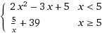
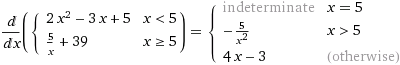

# Automatic Differentiation

> Find first derivatives of functions _automagically_

## How does it work?

Through the magic of [dual numbers](https://en.wikipedia.org/wiki/Dual_number), we can calculate the derivative of a function while calculating its value.

By using OCaml's operator overloading, we can abstract away the
implementation of these dual numbers and make it almost seamless in
operation.

## Usage

After `open`ing `Auto_differentiate`, one can easily use the
`D.val_deriv` function along with `D.operators` to construct a
function and its derivative.

For example, consider the following piecewise function:



The normal implementation of this would be using:

```OCaml
let f x =
    if x <. 5.
    then 2. *. x ** 2. -. 3. *. x +. 5.
    else 5. /. x +. 39.)
```

To calculate the derivative, along with the function's value itself,
we only need to update the function as follows:

```OCaml
let f, f' = D.val_deriv (fun x ->
    let open D.Operators in
    if x < ~$5.
    then ~$2. * x ** 2. - ~$3. * x + ~$5.
    else ~$5. / x + ~$39.)
```

Now, `f` calculates the value, while `f'` calculates the derivative.

The values outputted for this derivative `f'` match as per [WolframAlpha's output](http://www.wolframalpha.com/input/?i=differentiate+piecewise%5B%7B%7B2*x%5E2-3x%2B5,+x+%3C+5%7D,%7B5%2Fx%2B39,+x+%3E%3D+5%7D%7D%5D) when its is checked numerically:



The results for numerical computation can be checked using

```
corebuild test.native
./test.native
```

Obviously, the *indeterminate* case is not handled properly, and
instead, a value is returned based upon the `x >= 5` case.

## License

[MIT License](https://jay.mit-license.org/2017)

## Acknowledgements

Thanks to Demofox, for introducing me to Dual Numbers and Automatic Differentiation in their [blogpost](http://blog.demofox.org/2014/12/30/dual-numbers-automatic-differentiation/).
